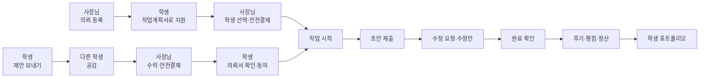
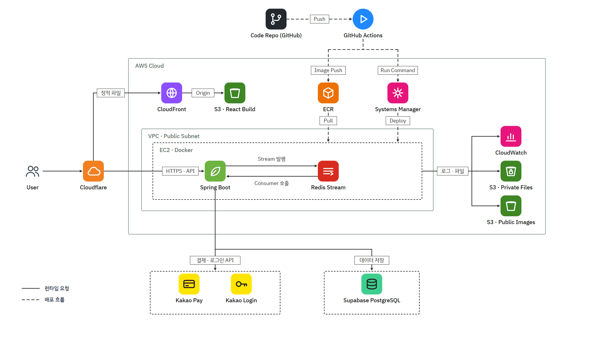

<p align="center">
  
</p>
<p align="center">
  <picture>
    <source media="(prefers-color-scheme: dark)" srcset="docs/images/brand/logo-golmok-white.png" />
    
  </picture>
</p>
<p align="center">
  <picture>
    <source media="(prefers-color-scheme: dark)" srcset="docs/images/brand/tagline-white.png" />
    
  </picture>
</p>

# 골목인턴

> 제안과 의뢰로 함께 만들어 가는 월계1동 골목상권

광운대학교 학생과 월계1동 가게를 잇는 동네 한정 외주 플랫폼입니다.
사장님은 필요한 일을 의뢰하고, 학생은 손님의 눈으로 찾은 개선점을 먼저 제안합니다.
다른 학생들은 손님으로서 제안에 공감하고, 작업은 안전결제 → 초안 → 수정 → 완료 순서로 진행됩니다.
끝난 작업은 후기·평점과 함께 학생의 포트폴리오로 쌓입니다.

2026 광운대학교 KW 해커톤 · 경영과컴퓨터 23조

## 개발 과정 및 상세 문서 모아보기 (노션 페이지 하단)
| 구분 | 주소 |
| --- | --- |
| 노션 | https://www.notion.so/2026-KW-0a0934d4ce52829080af81f185aacf3b?source=copy_link | 

## 바로 써 보기

| 구분 | 주소 |
| --- | --- |
| 서비스 바로가기 | https://gakkum.hubspacekw.com |
| (API 서버) | https://gakkum-api.hubspacekw.com |

로그인 화면에서 「둘러보기」를 누르면 체험용 사장님·학생 계정이 만들어져, 가입 없이 두 역할을 오가며 써 볼 수 있습니다.

## 핵심 기능

| 기능 | 방향 | 설명 |
| --- | --- | --- |
| 의뢰 | 사장님 → 학생 | 사장님이 할 일·작업비·마감을 정해 의뢰서를 올리면, 광운대 인증 학생이 작업계획서를 써서 지원합니다. 사장님은 전공·작업계획서·후기를 보고 학생을 고릅니다. |
| 제안 | 학생 → 사장님 | 학생이 손님 입장에서 느낀 불편과 전공을 살린 개선안을 희망 작업비·예상 기간과 함께 가게에 먼저 보냅니다. 사장님이 작업비·수정 횟수를 정해 결제하면 수락이 되고, 마감일은 학생이 제안한 기간으로 정해집니다. 학생이 의뢰서를 확인하고 「작업 시작」을 누르면 작업이 시작됩니다. |
| 공감 | 학생 → 제안 | 보낸 제안은 다른 학생에게 공개되고, 손님인 학생들이 공감을 누릅니다. 공감 수는 사장님 화면에 함께 보여 수락을 돕고, 공감이 10·30·50명이 될 때마다 사장님과 제안한 학생에게 알림이 갑니다. |
| 작업 과정 | 사장님 ↔ 학생 | 안전결제 → 초안 제출 → 수정 요청·수정안 → 완료 확인. 지금 단계와 내 차례가 화면 위에 보이고, 채팅으로 자료를 주고받습니다. 결과물을 받은 뒤 7일 동안 답이 없으면 자동으로 완료됩니다. |
| 포트폴리오·평점 | 사장님 → 학생 | 완료하면 별점·후기가 남고 작업비가 정산됩니다. 결과물과 후기는 학생 프로필에 쌓이고, 포트폴리오 파일로 내보낼 수 있습니다. |

그 밖에 카카오 로그인, 광운대 메일 인증(학생)과 사업자 진위 확인(사장님), 알림, 취소·환불 기준, 노쇼 패널티(운영자가 확인 후 기록, 학생 프로필에 횟수 표시)가 있습니다.

## 기획 문서

| 문서 | 내용 |
| --- | --- |
| [서비스 기획](docs/service-plan.md) | 서비스 개요·배경, 핵심 아이디어, 핵심 기능 요약, 타겟층·페르소나, 문제 정의, 제안·의뢰·공감·작업 흐름 |
| [핵심 기능](docs/core-features.md) | 6개 분야별 제안·의뢰 범위, 학과 인증, 전공역량·특기 뱃지, 받지 않는 일, 책임 약관 항목 |
| [취소·환불 정책](docs/cancel-refund-policy.md) | 시점별 취소 기준, 착수 보상·환불 금액 계산, 학생 문제 신고 절차 |

### 취소·환불 한눈에 보기

| 시점 | 학생 정산 | 사장님 환불 |
| --- | --- | --- |
| 의뢰 모집 중 (학생 선택·결제 전) | - | 결제 전이라 없음 |
| 제안 결제 후 작업 시작 전 (학생이 의뢰서 거절) | 0원 | 전액 |
| 작업 중 (의뢰는 결제 승인 뒤, 제안은 「작업 시작」 뒤 · 초안 제출 전) | 착수 보상 20% | 80% |
| 초안 제출 후 | 전액 (취소 불가) | - |
| 학생 문제 신고 (운영자 판단) | 인정 시 0원 / 불인정 시 20% | 인정 시 전액 / 불인정 시 80% |

## 서비스 흐름



## 아키텍처



- 프론트엔드: React 빌드 결과를 S3에 올리고 CloudFront로 제공합니다. 도메인은 Cloudflare를 거칩니다.
- 백엔드: EC2의 Docker에서 Spring Boot가 돌고, 알림은 Redis Stream으로 발행·소비합니다.
- 데이터: PostgreSQL(Supabase)에 저장하고, 첨부 파일은 비공개 S3, 프로필·매장 사진은 공개 S3 버킷에 둡니다.
- 외부 연동: 카카오 로그인, 카카오페이(안전결제), 국세청 사업자 진위 확인, 메일 발송.
- 배포: `main`에 백엔드 변경이 올라가면 GitHub Actions가 테스트 → Docker 이미지를 ECR에 올리고 → Systems Manager로 EC2에 배포합니다. 로그는 CloudWatch에서 봅니다.

## 기술 스택

| 영역 | 사용 기술 |
| --- | --- |
| Frontend | React 19, TypeScript, Vite, React Router |
| Backend | Java 21, Spring Boot 4, Spring Security · OAuth2(카카오), JWT, Spring Data JPA, Flyway |
| Data | PostgreSQL(Supabase), Redis(Stream), AWS S3 |
| Infra | AWS EC2 · ECR · Systems Manager · CloudWatch · CloudFront, Cloudflare, Docker, GitHub Actions |
| 외부 API | 카카오 로그인, 카카오페이, 국세청 사업자등록 진위확인 |

## 프로젝트 구조

```text
.
├── frontend/                     React 앱 (Vite · TypeScript)
│   ├── src/
│   │   ├── pages/                화면 단위 페이지 (사장님 · 학생 · 가입 · 채팅 · 결제 결과 등)
│   │   ├── features/             도메인별 API 호출 · 훅 · 화면 조각
│   │   │   ├── auth/             로그인 · 토큰 · 데모(둘러보기)
│   │   │   ├── signup/           가입 단계 · 학교 메일 인증 · 사업자 확인 · 약관
│   │   │   ├── owner/            사장님 홈 · 의뢰 · 지원자 · 작업 진행 · 취소 · 후기
│   │   │   ├── student/          학생 홈 · 지원 · 작업 제출 · 프로필 · 포트폴리오
│   │   │   ├── proposal/         제안 보내기 · 공감 · 수락 · 거절
│   │   │   ├── explore/          가게 · 의뢰 · 제안 둘러보기
│   │   │   ├── chat/             채팅방 · 작업 이력
│   │   │   ├── payment/          카카오페이 안전결제
│   │   │   ├── notification/     알림 목록 · 알림 이동 경로
│   │   │   └── specialty/        분야 · 특기 목록
│   │   ├── components/           공용 UI 컴포넌트 (버튼 · 시트 · 탭바 · 로딩 등)
│   │   ├── api/                  API 클라이언트 · 토큰 · 파일 업로드
│   │   ├── hooks/                공용 훅 (뒤로가기 · 화면 전환 · 지연 표시 등)
│   │   ├── lib/                  날짜 · 금액 · 파일 주소 등 공용 함수
│   │   ├── styles/               디자인 토큰 · 모션 · 눌림 효과
│   │   ├── types/                공용 타입
│   │   └── assets/               로고 · 아이콘 · 일러스트 · 로딩 캐릭터
│   ├── docs/
│   │   ├── decisions/            화면 · 구조 설계 결정 기록 (ADR)
│   │   ├── conventions/          코드 · 폴더 규칙
│   │   ├── domain/               용어집
│   │   └── failures/             장애 · 실수 기록
│   ├── scripts/                  폴더 구조 · 알림 경로 · 문서 검사 스크립트
│   └── public/                   파비콘 · 앱 아이콘
│
├── backend/                      Spring Boot API 서버 (Java 21)
│   ├── src/main/java/com/gakkum/backend/
│   │   ├── application/          기능별 Controller · DTO · Facade (+ 스케줄러)
│   │   │   └── auth · job · proposal · payment · chat · review · notification
│   │   │       · home · explore · owner · student · specialty · category · media · demo · jwt
│   │   ├── domain/               도메인별 Entity · Repository · Service
│   │   ├── config/               Security · S3 · 알림 스트림 · 자동 완료 설정
│   │   ├── filter/ · handler/    JWT 인증 · 요청 로그 · 카카오 로그인 성공 · 로그아웃
│   │   ├── global/               공통 응답 · 예외 · 로깅
│   │   └── util/                 JWT · ULID 생성
│   ├── src/main/resources/
│   │   ├── application.yaml      환경 변수로 읽는 설정
│   │   ├── db/migration/         Flyway 마이그레이션 SQL
│   │   └── mail/                 학교 메일 인증 메일 템플릿
│   ├── src/test/                 단위 · 통합 테스트
│   ├── harness/                  백엔드 구조 · 규칙 문서 (core 는 서브모듈)
│   ├── Dockerfile                배포 이미지
│   └── compose.redis.yaml        로컬 Redis
│
├── docs/                         기획 문서 (서비스 기획 · 핵심 기능 · 취소·환불 정책) · README 이미지
└── .github/                      이슈 · PR 템플릿, 백엔드 CI/CD 워크플로
```
## 브랜치

- `dev`: 기본 브랜치. 기능 브랜치의 PR이 모이는 곳입니다.
- `main`: 배포 브랜치. `dev`를 합치면 백엔드가 배포됩니다.
- 작업 브랜치: `{파트}/{타입}/{번호}` (예: `frontend/feature/325`). 각자 포크에 올리고 조직 저장소 `dev`로 PR을 냅니다.

## 문서

- [서비스 기획](docs/service-plan.md) · [핵심 기능](docs/core-features.md) · [취소·환불 정책](docs/cancel-refund-policy.md): 기획 문서
- [frontend/README.md](frontend/README.md): 프론트엔드 실행·검사 방법
- [frontend/docs/decisions](frontend/docs/decisions): 화면·구조 설계 결정 기록
- [frontend/docs/conventions](frontend/docs/conventions): 코드·폴더 규칙
- [backend/harness/project](backend/harness/project): 백엔드 구조와 규칙

## 팀

경영과컴퓨터 23조 · 이광은, 박지홍, 조성찬, 문현웅
