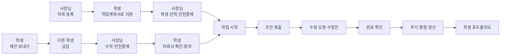

# 골목인턴

> 제안과 의뢰로 함께 만들어 가는 월계1동 골목상권

광운대학교 학생과 월계1동 가게를 잇는 동네 한정 외주 플랫폼입니다.
사장님은 필요한 일을 의뢰하고, 학생은 손님의 눈으로 찾은 개선점을 먼저 제안합니다.
다른 학생들은 손님으로서 제안에 공감하고, 작업은 안전결제 → 초안 → 수정 → 완료 순서로 진행됩니다.
끝난 작업은 후기·평점과 함께 학생의 포트폴리오로 쌓입니다.

2026 광운대학교 KW 해커톤 · 경영과컴퓨터 23조

## 개발 과정 및 상세 문서 모아보기 (노션 페이지 하단)
| 구분 | 주소 |
| --- | --- |
| 노션 | https://www.notion.so/2026-KW-0a0934d4ce52829080af81f185aacf3b?source=copy_link | 

## 바로 써 보기

| 구분 | 주소 |
| --- | --- |
| 서비스 바로가기 | https://gakkum.hubspacekw.com |
| (API 서버) | https://gakkum-api.hubspacekw.com |

로그인 화면에서 「둘러보기」를 누르면 체험용 사장님·학생 계정이 만들어져, 가입 없이 두 역할을 오가며 써 볼 수 있습니다.

## 핵심 기능

| 기능 | 방향 | 설명 |
| --- | --- | --- |
| 의뢰 | 사장님 → 학생 | 사장님이 할 일·작업비·마감을 정해 의뢰서를 올리면, 광운대 인증 학생이 작업계획서를 써서 지원합니다. 사장님은 전공·작업계획서·후기를 보고 학생을 고릅니다. |
| 제안 | 학생 → 사장님 | 학생이 손님 입장에서 느낀 불편과 전공을 살린 개선안을 가게에 먼저 보냅니다. 사장님이 수락하면 제안을 바탕으로 의뢰서가 만들어집니다. |
| 공감 | 학생 → 제안 | 보낸 제안은 다른 학생에게 공개되고, 손님인 학생들이 공감을 누릅니다. 공감 수는 사장님 화면에 함께 보여 수락을 돕습니다. |
| 작업 과정 | 사장님 ↔ 학생 | 안전결제 → 초안 제출 → 수정 요청·수정안 → 완료 확인. 지금 단계와 내 차례가 화면 위에 보이고, 채팅으로 자료를 주고받습니다. 결과물을 받은 뒤 7일 동안 답이 없으면 자동으로 완료됩니다. |
| 포트폴리오·평점 | 사장님 → 학생 | 완료하면 별점·후기가 남고 작업비가 정산됩니다. 결과물과 후기는 학생 프로필에 쌓이고, 포트폴리오 파일로 내보낼 수 있습니다. |

그 밖에 카카오 로그인, 광운대 메일 인증(학생)과 사업자 진위 확인(사장님), 알림, 취소·환불 기준, 노쇼 패널티가 있습니다.

## 서비스 흐름



## 아키텍처


- 프론트엔드: React 빌드 결과를 S3에 올리고 CloudFront로 제공합니다. 도메인은 Cloudflare를 거칩니다.
- 백엔드: EC2의 Docker에서 Spring Boot가 돌고, 알림은 Redis Stream으로 발행·소비합니다.
- 데이터: PostgreSQL(Supabase)에 저장하고, 첨부 파일은 비공개 S3, 프로필·매장 사진은 공개 S3 버킷에 둡니다.
- 외부 연동: 카카오 로그인, 카카오페이(안전결제), 국세청 사업자 진위 확인, 메일 발송.
- 배포: `main`에 백엔드 변경이 올라가면 GitHub Actions가 테스트 → Docker 이미지를 ECR에 올리고 → Systems Manager로 EC2에 배포합니다. 로그는 CloudWatch에서 봅니다.

## 기술 스택

| 영역 | 사용 기술 |
| --- | --- |
| Frontend | React 19, TypeScript, Vite, React Router |
| Backend | Java 21, Spring Boot 4, Spring Security · OAuth2(카카오), JWT, Spring Data JPA, Flyway |
| Data | PostgreSQL(Supabase), Redis(Stream), AWS S3 |
| Infra | AWS EC2 · ECR · Systems Manager · CloudWatch · CloudFront, Cloudflare, Docker, GitHub Actions |
| 외부 API | 카카오 로그인, 카카오페이, 국세청 사업자등록 진위확인 |

## 폴더 구조

```text
.
├── frontend/   React 앱 (화면, API 연동, 설계 결정 기록)
├── backend/    Spring Boot API 서버 (Flyway 마이그레이션 포함)
├── docs/       README 이미지
└── .github/    이슈·PR 템플릿, 백엔드 CI/CD 워크플로
```

## 로컬에서 실행하기

### Frontend

```bash
cd frontend
cp .env.example .env.local   # VITE_BACKEND_API_BASE_URL 에 연결할 API 서버 주소
npm ci
npm run dev                  # http://localhost:5173
```

`npm run check`로 lint · 타입 검사 · 빌드를 한 번에 확인합니다.

### Backend

Java 21, PostgreSQL, Redis가 필요합니다.

```bash
git submodule update --init                   # backend/harness/core
cd backend
docker compose -f compose.redis.yaml up -d    # 로컬 Redis
./gradlew bootRun
```

설정 값은 `backend/src/main/resources/application.yaml`이 환경 변수에서 읽습니다. 실행 전에 아래 값을 채워 주세요(값은 저장소에 올리지 않습니다).

- `DATABASE_URL`, `DATABASE_MAX_POOL_SIZE` 등 `DATABASE_*` 풀 설정
- `JWT_SECRET`
- `KAKAO_CLIENT_ID`, `KAKAO_CLIENT_SECRET`, `KAKAO_REDIRECT_URI`
- `KAKAO_PAY_SECRET_KEY`, `KAKAO_PAY_FRONTEND_BASE_URL`
- `MAIL_HOST`, `MAIL_PORT`, `MAIL_USERNAME`, `MAIL_PASSWORD`
- `NTS_BUSINESSMAN_SERVICE_KEY`
- `S3_BUCKET`, `S3_IMAGE_BUCKET` (`S3_REGION` 기본값 `ap-northeast-1`)
- 필요하면 `REDIS_*`, `FRONTEND_ALLOWED_ORIGIN_PATTERNS`

DB 스키마는 시작할 때 Flyway가 `db/migration`의 SQL을 적용합니다. 테스트는 `./gradlew test`로 돌립니다.

## 브랜치

- `dev`: 기본 브랜치. 기능 브랜치의 PR이 모이는 곳입니다.
- `main`: 배포 브랜치. `dev`를 합치면 백엔드가 배포됩니다.

## 문서

- [frontend/README.md](frontend/README.md): 프론트엔드 실행·검사 방법
- [frontend/docs/decisions](frontend/docs/decisions): 화면·구조 설계 결정 기록
- [frontend/docs/conventions](frontend/docs/conventions): 코드·폴더 규칙
- [backend/harness/project](backend/harness/project): 백엔드 구조와 규칙

## 팀

경영과컴퓨터 23조 · 이광은, 박지홍, 조성찬, 문현웅
